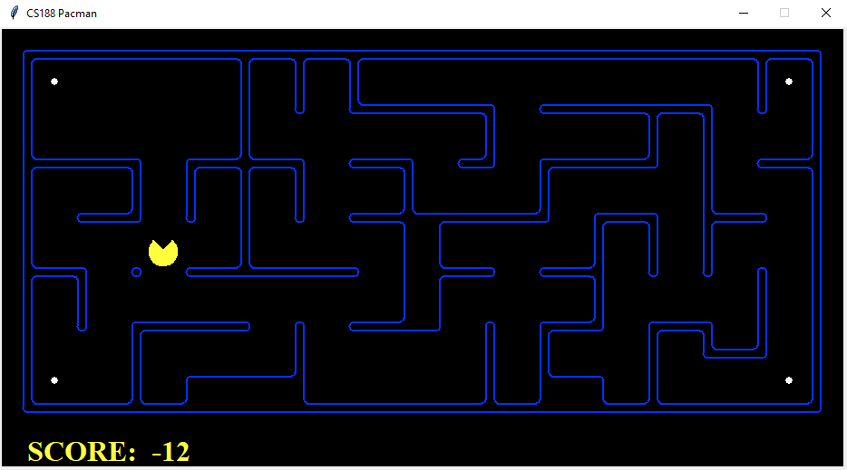
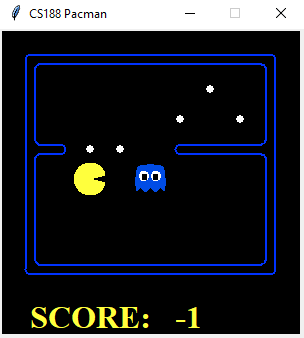

# Intro-AI-Projects
Projects we had in our course on introduction to artificial intelligence in 2018

## Links

- Here is the link to the course : [info8006-introduction-to-ai](https://github.com/glouppe/info8006-introduction-to-ai)
- Part 1: [Search algorithms](https://github.com/glouppe/info8006-introduction-to-ai/tree/master/projects/project1)
- Part 2: [Adversarial search](https://github.com/glouppe/info8006-introduction-to-ai/tree/master/projects/project2)
- Part 3: [Bayes filter](https://github.com/glouppe/info8006-introduction-to-ai/tree/master/projects/project3)
- Reading assignment : [Mastering the game of Go with deep neural networks and tree search](https://www.researchgate.net/publication/292074166_Mastering_the_game_of_Go_with_deep_neural_networks_and_tree_search)

## How to run the program

- python run.py
- python run.py --layout medium
- python run.py --layout large --agentfile Projet1/bfs.py
- python run.py --layout small_adv --agent Projet2/minimax.py
- python run.py --agentfile humanagent.py --bsagentfile Projet3/beliefstateagent.py --ghostagent dumby --layout large_adv

